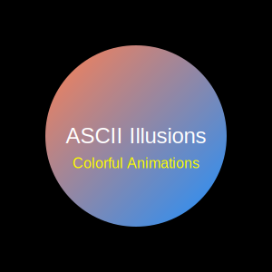

# ASCII Illusions using ncurses

This project consists of several ASCII animations created using the `ncurses` library in C. Each program creates a unique visual illusion in the terminal, utilizing various patterns, movements, and color effects. The illusions include spinning lines, falling characters (Matrix code rain), expanding circles, and zig-zag patterns.

## Table of Contents
- [Features](#features)
- [Requirements](#requirements)
- [Installation](#installation)
- [Usage](#usage)
- [Illusion Descriptions](#illusion-descriptions)
- [Contributing](#contributing)

## Features
- **Colorful animations**: Each illusion incorporates vibrant colors using the `ncurses` library's color functionality.
- **Unique visual effects**: Four different types of illusions provide varied visual experiences in the terminal.
- **Customizable delay**: The animation speed can be easily adjusted.

## Requirements
- C compiler (GCC recommended)
- `ncurses` library installed on your system

### Installing ncurses on Ubuntu/Linux
```bash
sudo apt-get install libncurses5-dev libncursesw5-dev
```
Installing ncurses on macOS
```
brew install ncurses
```
Installation

1. Clone the repository:
```
git clone https://github.com/rkstudio585/ASCII-Illusions.git
cd ASCII-Illusions
```

2. Compile each illusion program using GCC:
```
gcc -o spinning_lines spinning_lines.c -lncurses -lm
gcc -o matrix_rain matrix_rain.c -lncurses -lm
gcc -o expanding_circles expanding_circles.c -lncurses -lm
gcc -o zigzag zigzag.c -lncurses -lm
```


Usage

Run each illusion program from the terminal:
```
./spinning_lines
./matrix_rain
./expanding_circles
./zigzag
```
Press Ctrl + C to exit any of the animations.

Illusion Descriptions

1. Spinning Lines

Description: This illusion features lines radiating from the center of the screen, rotating in a circular motion. The colors of the lines change over time, creating a dynamic effect.

Mechanism: It uses trigonometric functions (sine and cosine) to calculate the line positions based on an angle that increments over time.


2. Matrix Code Rain

Description: Inspired by the Matrix movie, this illusion simulates falling characters that randomly appear across the screen. The characters are ASCII symbols, creating a visually striking effect.

Mechanism: Random ASCII characters are printed in a loop with a specified probability, using the rand() function to control their appearance.


3. Expanding Circles

Description: This program generates circles that expand outward from the center of the screen. As the circles grow, their colors cycle through a range of available colors.

Mechanism: The radius of the circles increases incrementally, and points along the circumference are calculated using trigonometric functions.


4. Zig-Zag Illusion

Description: This animation creates a zig-zag pattern that shifts horizontally across the screen. The pattern changes color with each frame, producing a lively effect.

Mechanism: The zig-zag pattern is determined by modular arithmetic, and it moves across the screen by incrementing an offset value.


Contributing

Contributions to enhance this project are welcome! If you have ideas for new illusions or improvements, please feel free to submit a pull request.

---
